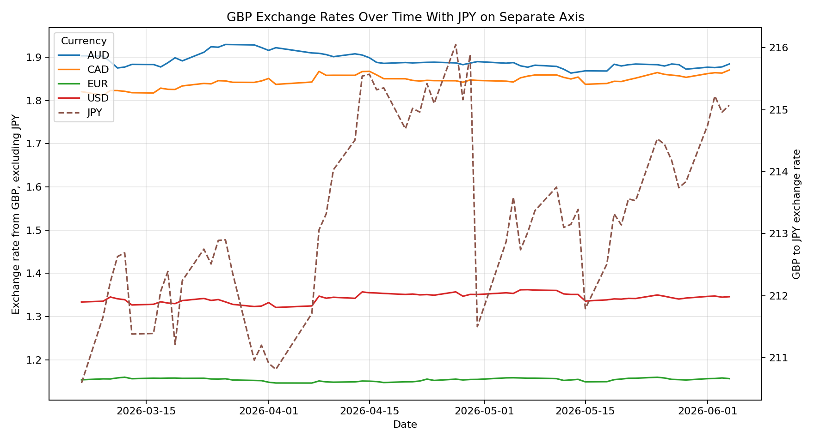
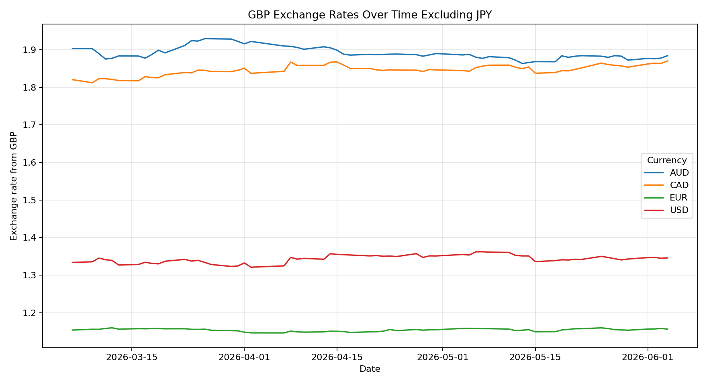
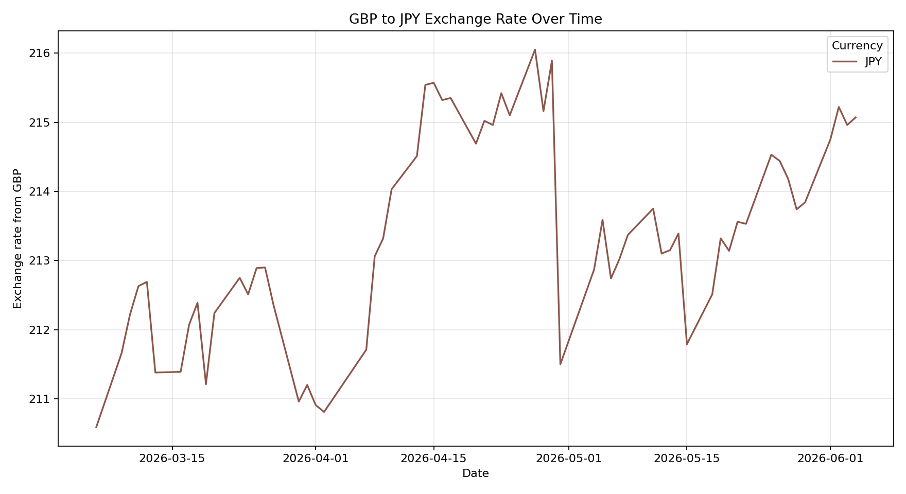
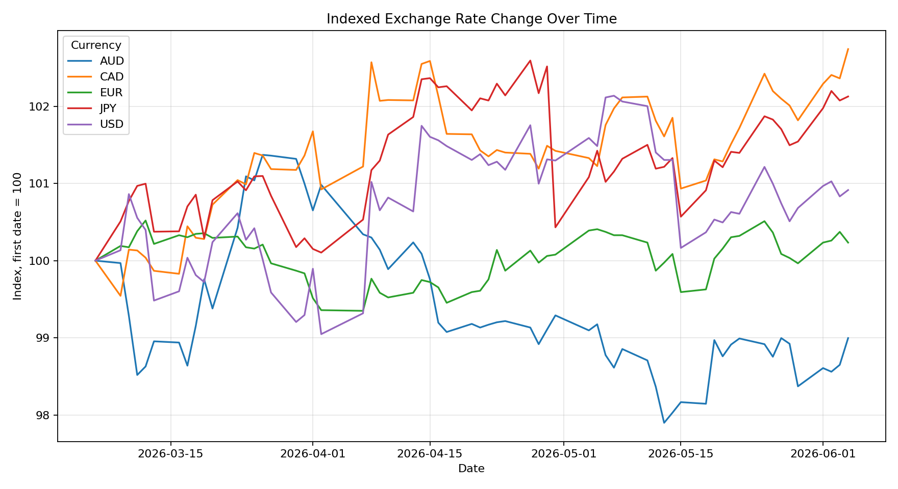
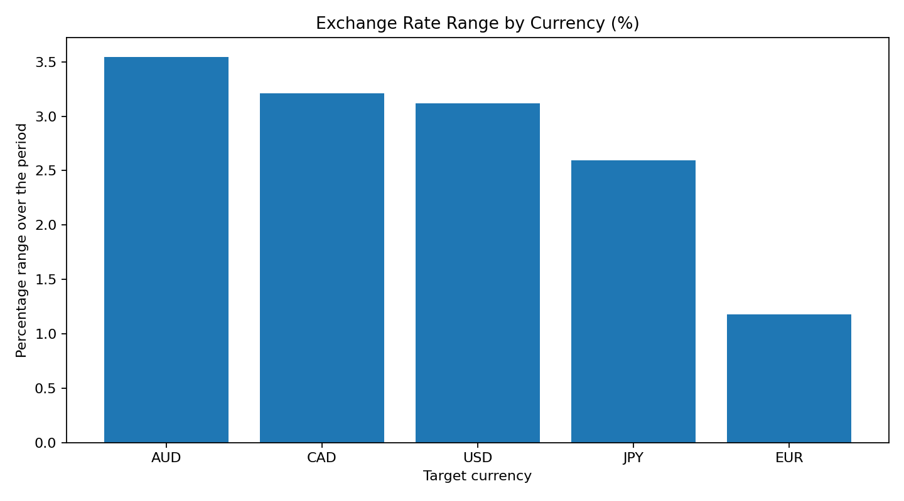

# AWS Python ETL Pipeline

A beginner-friendly data engineering project that extracts exchange-rate data from a public API, transforms it with Python, saves clean datasets, and creates simple charts.

The project is designed to show the basic shape of an ETL pipeline:

**Extract → Transform → Load → Analyse**

## Project Summary

This pipeline collects recent exchange rates using GBP as the base currency and compares it against USD, EUR, JPY, CAD and AUD.

The local version saves:

- raw API data as JSON
- cleaned exchange-rate data as CSV
- summary metrics by currency
- visual charts for analysis

There is also an optional AWS script for uploading processed files to S3 once AWS credentials are configured.

## Tools Used

- Python
- pandas
- requests
- matplotlib
- AWS S3 optional extension
- Athena example SQL optional extension

## Project Structure

```text
.
├── data/
│   ├── raw/                  # Raw API response
│   └── processed/            # Clean CSV outputs
├── docs/                     # Architecture and Athena SQL example
├── outputs/
│   └── charts/               # Generated charts
├── src/                      # ETL pipeline scripts
├── .env.example              # Optional AWS config example
├── requirements.txt
└── README.md
```

## Pipeline Steps

### 1. Extract

`src/extract_exchange_rates.py` pulls exchange-rate data from the Frankfurter public API.

Output:

- `data/raw/exchange_rates_raw.json`

### 2. Transform

`src/transform_exchange_rates.py` converts the nested JSON response into clean tabular data.

Outputs:

- `data/processed/exchange_rates_clean.csv`
- `data/processed/exchange_rates_summary.csv`

### 3. Analyse

`src/create_charts.py` creates charts from the processed data.

Outputs:

- `outputs/charts/exchange_rates_dual_axis_with_jpy.png`
- `outputs/charts/exchange_rates_over_time_excluding_jpy.png`
- `outputs/charts/gbp_to_jpy_exchange_rate.png`
- `outputs/charts/indexed_exchange_rate_change.png`
- `outputs/charts/exchange_rate_percentage_range_by_currency.png`

### 4. Optional AWS Load

`src/upload_to_s3.py` can upload the processed CSV files to an S3 bucket after AWS credentials are configured locally.

## Charts

### GBP Exchange Rates With JPY on a Separate Axis

JPY has much larger exchange-rate values than the other selected currencies. This chart keeps all currencies in one view, but uses a separate right-hand axis for JPY so the other lines remain readable.



### GBP Exchange Rates Over Time Excluding JPY

This version removes JPY completely so the movement of USD, EUR, CAD and AUD can be seen more clearly on one scale.



### GBP to JPY Exchange Rate



### Indexed Exchange Rate Change

The selected currencies have very different exchange-rate values, so plotting them on one raw scale can make smaller-valued currencies difficult to see. To compare their movement more fairly, this chart converts each currency into an index.

Each currency starts at 100 on the first date in the dataset. Later values show how much that currency has moved relative to its own starting point.

For example:

- 100 means no change from the first date
- 102 means the exchange rate is about 2% higher than on the first date
- 98 means the exchange rate is about 2% lower than on the first date

This makes it easier to compare trends across currencies, even when one currency, such as JPY, has much larger raw exchange-rate numbers than currencies like USD or EUR.



### Exchange Rate Percentage Range by Currency

The currencies in this dataset have very different exchange-rate scales. For example, GBP to JPY is around 210–216, while GBP to USD is around 1.32–1.36. If I compare the raw difference between minimum and maximum values, JPY appears much larger mainly because it is measured on a larger numerical scale.

To make the comparison fairer, this chart uses the percentage range:

```text
(maximum exchange rate - minimum exchange rate) / minimum exchange rate × 100
```

This shows relative movement within each currency over the period, rather than simply showing which currency has the largest raw numbers.



## How to Run Locally

Create and activate a virtual environment:

```bash
python3 -m venv .venv
source .venv/bin/activate
```

Install requirements:

```bash
pip install -r requirements.txt
```

Run the full pipeline:

```bash
python src/run_pipeline.py
```

If Matplotlib has cache permission issues, run:

```bash
MPLCONFIGDIR=.cache/matplotlib XDG_CACHE_HOME=.cache python src/run_pipeline.py
```

## Optional AWS S3 Upload

Create a `.env` file from `.env.example`:

```bash
cp .env.example .env
```

Add your bucket name:

```text
AWS_S3_BUCKET=your-bucket-name-here
```

Then run:

```bash
python src/upload_to_s3.py
```

## Example Athena Query

An example Athena query is included in:

`docs/athena_example.sql`

This shows how the processed data could be queried after being uploaded to S3 and registered as an Athena table.

## What I Practised

- Building a simple ETL pipeline
- Working with a public API
- Cleaning nested JSON data into tabular CSV files
- Creating summary metrics with pandas
- Producing simple visualisations
- Structuring a GitHub project clearly
- Preparing an optional AWS S3 extension

## Next Improvements

- Add automated data validation checks
- Add a scheduled pipeline run
- Create an Athena table definition
- Add a small dashboard using Streamlit or Power BI
