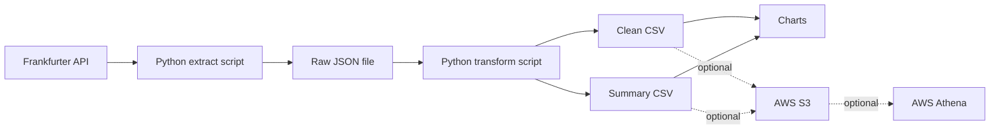

# Project Architecture

## Local Pipeline

The local version extracts exchange-rate data from a public API, saves a raw JSON file, transforms it into clean CSV outputs, and creates charts.

## Optional AWS Extension

After AWS credentials are configured, the processed CSV files can be uploaded to S3. They can then be queried with Athena as a simple cloud data workflow.
